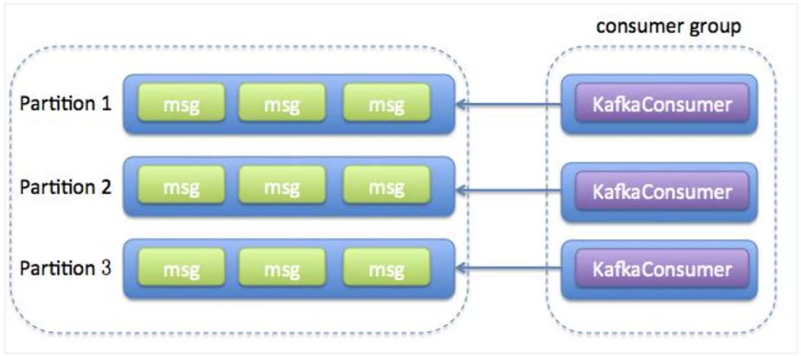
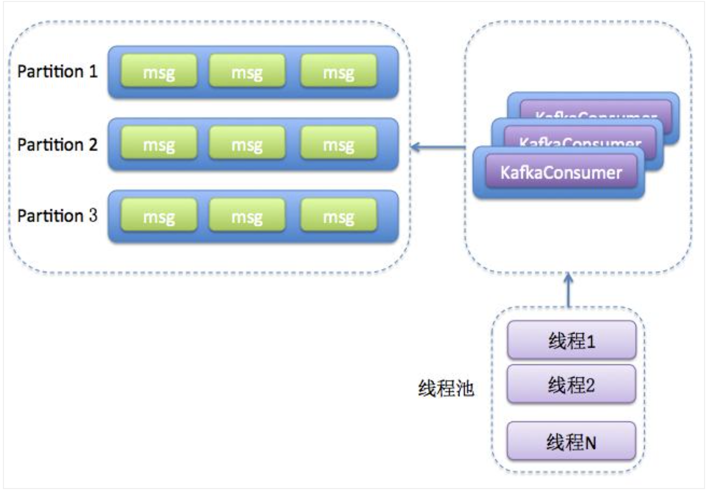

# Background

This article tries to give an example of a multi-threaded consumer written in KafkaConsumer.


# Details

KafkaConsumer is different from KafkaProducer, which is thread-safe, so we encourage users to share a KafkaProducer instance in multiple threads, which is usually more efficient than maintaining a KafkaProducer instance per thread. But for KafkaConsumer, it is not thread-safe, so there are usually two ways to implement multi-threading.
1 Each thread maintains a KafkaConsumer

2 Maintain one or more KafkaConsumer, and maintain multiple event processing threads (worker thread) at the same time


Below we implement these two methods separately. It should be pointed out that the following code is the most basic implementation, and does not consider many programming details, such as how to handle errors.
method 1
ConsumerRunnable class
```
import org.apache.kafka.clients.consumer.ConsumerRecord;
import org.apache.kafka.clients.consumer.ConsumerRecords;
import org.apache.kafka.clients.consumer.KafkaConsumer;
 
import java.util.Arrays;
import java.util.Properties;
 
public class ConsumerRunnable implements Runnable {
 
    // Each thread maintains a private KafkaConsumer instance
    private final KafkaConsumer<String, String> consumer;
 
    public ConsumerRunnable(String brokerList, String groupId, String topic) {
        Properties props = new Properties();
        props.put("bootstrap.servers", brokerList);
        props.put("group.id", groupId);
                 props.put("enable.auto.commit", "true"); //This example uses automatic commit displacement
        props.put("auto.commit.interval.ms", "1000");
        props.put("session.timeout.ms", "30000");
        props.put("key.deserializer", "org.apache.kafka.common.serialization.StringDeserializer");
        props.put("value.deserializer", "org.apache.kafka.common.serialization.StringDeserializer");
        this.consumer = new KafkaConsumer<>(props);
                 consumer.subscribe(Arrays.asList(topic)); // This example uses partition copy automatic allocation strategy
    }
 
    @Override
    public void run() {
        while (true) {
                         ConsumerRecords<String, String> records = consumer.poll(200); // This example uses 200ms as the acquisition timeout
            for (ConsumerRecord<String, String> record : records) {
                                 // Write the message processing logic in this case, in this case, simply print the message
                System.out.println(Thread.currentThread().getName() + " consumed " + record.partition() +
                        "th message with offset: " + record.offset());
            }
        }
    }
}
```

ConsumerGroup class
```
package com.my.kafka.test;
 
import java.util.ArrayList;
import java.util.List;
 
public class ConsumerGroup {
 
    private List<ConsumerRunnable> consumers;
 
    public ConsumerGroup(int consumerNum, String groupId, String topic, String brokerList) {
        consumers = new ArrayList<>(consumerNum);
        for (int i = 0; i < consumerNum; ++i) {
            ConsumerRunnable consumerThread = new ConsumerRunnable(brokerList, groupId, topic);
            consumers.add(consumerThread);
        }
    }
 
    public void execute() {
        for (ConsumerRunnable task : consumers) {
            new Thread(task).start();
        }
    }
}
```

ConsumerMain class
```
public class ConsumerMain {
 
    public static void main(String[] args) {
        String brokerList = "localhost:9092";
        String groupId = "testGroup1";
        String topic = "test-topic";
        int consumerNum = 3;
 
        ConsumerGroup consumerGroup = new ConsumerGroup(consumerNum, groupId, topic, brokerList);
        consumerGroup.execute();
    }
} 
```

Method 2
```
Worker class
import org.apache.kafka.clients.consumer.ConsumerRecord;
 
public class Worker implements Runnable {
 
    private ConsumerRecord<String, String> consumerRecord;
 
    public Worker(ConsumerRecord record) {
        this.consumerRecord = record;
    }
 
    @Override
    public void run() {
                 // Write your message processing logic here, in this case, simply print the message
        System.out.println(Thread.currentThread().getName() + " consumed " + consumerRecord.partition()
            + "th message with offset: " + consumerRecord.offset());
    }
}
```

ConsumerHandler class
```
import org.apache.kafka.clients.consumer.ConsumerRecord;
import org.apache.kafka.clients.consumer.ConsumerRecords;
import org.apache.kafka.clients.consumer.KafkaConsumer;
 
import java.util.Arrays;
import java.util.Properties;
import java.util.concurrent.ArrayBlockingQueue;
import java.util.concurrent.ExecutorService;
import java.util.concurrent.ThreadPoolExecutor;
import java.util.concurrent.TimeUnit;
 
public class ConsumerHandler {
 
         // In this example, a consumer is used to put the message into the back-end queue. Of course, you can use multiple instances in the previous method to put the message into the back-end queue at the same time according to a certain rule.
    private final KafkaConsumer<String, String> consumer;
    private ExecutorService executors;
 
    public ConsumerHandler(String brokerList, String groupId, String topic) {
        Properties props = new Properties();
        props.put("bootstrap.servers", brokerList);
        props.put("group.id", groupId);
        props.put("enable.auto.commit", "true");
        props.put("auto.commit.interval.ms", "1000");
        props.put("session.timeout.ms", "30000");
        props.put("key.deserializer", "org.apache.kafka.common.serialization.StringDeserializer");
        props.put("value.deserializer", "org.apache.kafka.common.serialization.StringDeserializer");
        consumer = new KafkaConsumer<>(props);
        consumer.subscribe(Arrays.asList(topic));
    }
 
    public void execute(int workerNum) {
        executors = new ThreadPoolExecutor(workerNum, workerNum, 0L, TimeUnit.MILLISECONDS,
                new ArrayBlockingQueue<>(1000), new ThreadPoolExecutor.CallerRunsPolicy());
 
        while (true) {
            ConsumerRecords<String, String> records = consumer.poll(200);
            for (final ConsumerRecord record : records) {
                executors.submit(new Worker(record));
            }
        }
    }
 
    public void shutdown() {
        if (consumer != null) {
            consumer.close();
        }
        if (executors != null) {
            executors.shutdown();
        }
        try {
            if (!executors.awaitTermination(10, TimeUnit.SECONDS)) {
                System.out.println("Timeout.... Ignore for this case");
            }
        } catch (InterruptedException ignored) {
            System.out.println("Other thread interrupted this shutdown, ignore for this case.");
            Thread.currentThread().interrupt();
        }
    }
 
}
```

Main class
```
public class Main {
 
    public static void main(String[] args) {
        String brokerList = "localhost:9092,localhost:9093,localhost:9094";
        String groupId = "group2";
        String topic = "test-topic";
        int workerNum = 5;
 
        ConsumerHandler consumers = new ConsumerHandler(brokerList, groupId, topic);
        consumers.execute(workerNum);
        try {
            Thread.sleep(1000000);
        } catch (InterruptedException ignored) {}
        consumers.shutdown();
    }
}
```

To sum up, these two methods or models have their own advantages and disadvantages. In specific use, you need to choose the corresponding method according to your actual business characteristics. Personally, I admire the second method and the idea behind it, that is, don’t put heavy processing logic in the consumer’s code. Many Kafka consumer users encounter various rebalance timeouts and coordinator re-elections. , Heartbeat can not be maintained and other problems stem from this.


# References

Kafka Consumer multi-threaded instance
https://www.programmersought.com/article/11854192236/


